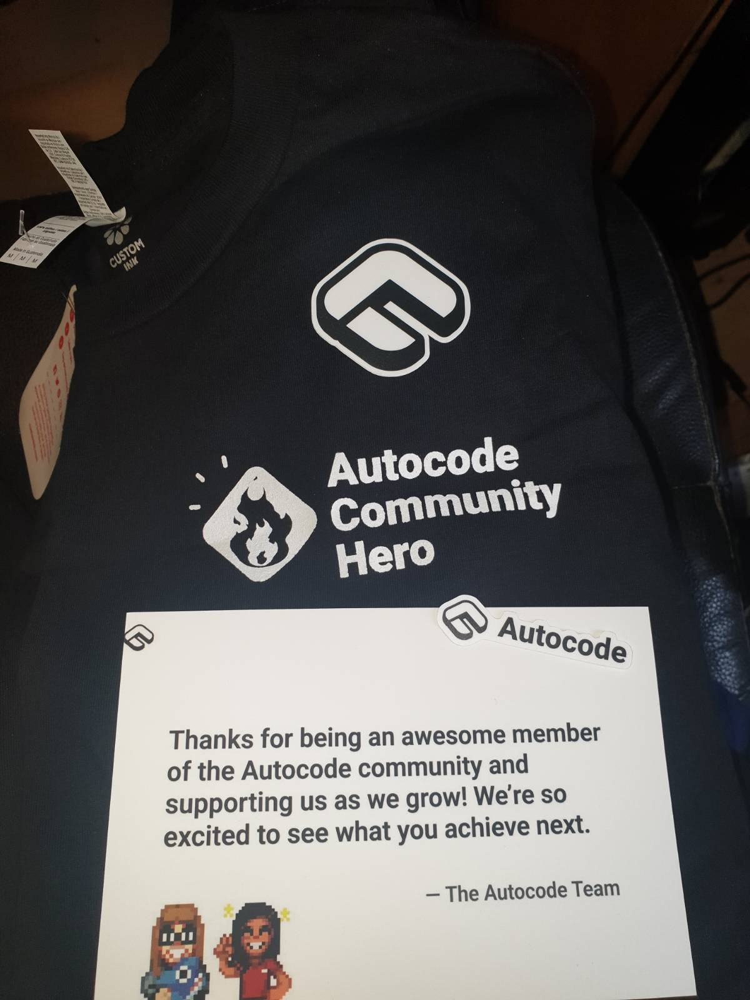

# autocode-apps
#### My "apps" (aka public coding projects), which were coded and publicly available on Autocode(autocode.com), before it shut down.

## Apps

### welcome-leave, published as Sticky Roles

For giving back a member's roles when they rejoin a Discord server

#### [View the full README](https://github.com/randomguy400/autocode-apps/blob/main/welcome-leave/README.md)

## Autocode background

Autocode was a San Fransico/Toronto based company, who made it much easier to code and connect with API's. They were founded in 2016 (I think). 
It used FunctionScript (which is ["a language and specification for turning JavaScript functions into typed HTTP APIs"](https://github.com/FunctionScript)).

Their most notable and used (but not financially viable for the business) was Discord API. 
It attracted many people like me, during lockdown, who wanted to code their own Discord bots. 
Autocode offered an easy-to-use online IDE, many public projects, amazing support (by Autocode staff and community) and free hosting.

They also had many other useful APIs like Google Sheets, Slack, Airtable and Notion.

I was able to learn a lot of JavaScript with no knowledge through Autocode.
However, this was not financially viable (aka lots of teenagers/young adults operating on the free plan to run their Discord bots) and Autocode had to make drastic pricing measures/free user limits later on.

In April 2024, Autocode shut down and Keith (the CEO) [accepted a job at OpenAI](https://x.com/keithwhor/status/1775551821286965290).

*A thank you from the Autocode team to all the Community Hero's, when their Community Hero program shut down*
