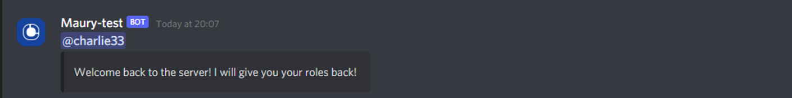

# <ins> Sticky roles </ins>

## **An app that will give a user back their roles on rejoin, based on the settings you set.**

### It can:

1. Save a users roles for re-assignment on re join to a server  
 
  
 
2. Detect if a user has joined in the past, and send a different welcome message:  
 
  
 
3. Exclude certain roles from re assignment, which can be managed by either slash or prefix commands (Administrator only) 
 
  

### <ins> Setup </ins>

<ins> **Enviroment variables:**  </ins>

• **welcome-channel**: Set a channel where your bot welcome's members back. Just copy the ID of it by right-clicking on the channel name

• **PREFIX**: The prefix you want your bot to use (eg !)
 
**This is not mandatory for it to work as you can use slash commands instead**

<ins> **Saving Roles:** </ins>

The roles of your users aren't saved yet! To save them you must use the *refresh_roles.js* file.

Just click on the link to run the file, as shown below. Make sure your bot is in a server as well! 

  
 

You can now close that tab and go back to your code window. Go to bottom left and click 'View logs'. 
It should look something like this:
 
  
 
If there are errors, a link for the Autocode Support Server is at the bottom for help

#### Note:

• **If your bot is added to a new guild, you will need to run the code again**

• **If your bot is in lots of guilds and/or with lots of members, you may reach your execution timeout limit.**
**Make sure it is set to 30000ms (bottom left -> Advanced settings) to allow for a greater amount of time**

• **After that, the bot should be logging all other role changes automatically in** *update.js*

 <ins>**Excluded roles:** </ins>

#### What are they?

These are roles which are excluded from sticky roles and **will not be added to members when they rejoin**, even if they had that role.

<ins>*Commands* </ins>

• `excluded-roles-add` - This adds the specified role onto the list. You can @ the role or the ID to specify the role
  
• `excluded-roles-remove`- This removes a specified role off the list. You can @ the role or the ID to specify the role
  
• `excluded-roles-list` - This lists all the excluded roles in that server

• `excluded-roles-clear` - This clears all the excluded roles for that server
 

<ins> **Slash command setup** </ins>  
 

 
 

1. Go to Autocode's handy Slash Command Builder: https://autocode.com/tools/discord/command-builder/

2. Link your bot using **link account** option at the top

3. Make all 4 slash commands: `excluded-roles-add`, `excluded-roles-remove`, `excluded-roles-clear` and `excluded-roles-list`

4. For *excluded-roles-add* and *excluded-roles-remove* set a *required* option on each. Set type to *Role*. You can set name and description to whatever you want

### Then, you can add roles as simply as this!

  
 

### And if you use the command incorrectly it will tell you:  
 

 
 

### Also, it checks the ID. Giving an invalid ID will return this: 
 

 
 

### Required bot permissions

*Your bot needs to be invited to the server with minimum permissions of:*
`Manage Roles`
`View Channels`
`Send Messages`
(If you are using slash commands) `Use Slash Commands`

Your bot also needs **Server Members Intent** enabled

You can do this by going to: 
https://discord.com/developers/applications -> [Your bot] -> Bot -> Privileged Gateway Intents -> **Enable Server Members Intent**

Also, make sure your bot's highest role is at the top. This is normally the main cause of permission errors when adding roles
 
The app should warn you if it failed to give any roles to a certain user

### How is the data stored?

All data is stored using *utils.kv* and is exclusive for each guild, so you can use this app for multiple guilds 💯

*A users roles are logged with the format:*

**key:** `[guild ID][user ID]_roles`
 
**value:** `[users roles in an array as <@&ROLE_ID>]`

*Excluded roles are logged with the format:*

**key:** `[guild ID]_excludedroles`
 
**value:** `[roles in array as <@&ROLE_ID>]`

*Users who have left the server are logged with the format:*

**key:** `[guild ID]_leave`
 
**value:** `users ID's in array`

Hope this is a useful guide to setting up this app!
  
If you encounter any problems, you can join the helpful Autocode Support Server here -> https://discord.gg/autocode

**Thanks to all the Autocode staff who assisted me in making this!**